#Concolic Analysis for Android (CAA)

## Description

The goal of this project is to provide a tool to allow concolic analysis of arbitrary black box Android APKs.  The long term intention is for the analysis of APKs in order to detect malicious clones, but the tool stands on its own.

## General setup:

1. Set up the VM
  1.  [Install Vagrant](http://docs.vagrantup.com/v2/installation/)
  2. Go to the root directory of the repo (where this file is)
  3. Run "vagrant up" and wait for the machine to come online
  4. Run "vagrant ssh" to enter tphe virtual machine
2. All included projects will be in "~/Workspace/" in the VM
3. Needed tools should be all installed via puppet or vagrant scripts.  No configuration there should be necessary.

## Requirements

Linux or possibly OSX only.  *Windows is not supported at this time.*  Hence, the management has provided a lovely Vagrant virtual machine.

## CAA Project Setup:

1. In the VM, navigate to "~/Workspace/AnalysisEngine"
2. In the host OS, import "AnalysisEngine/AndroidAnalysisEngine/" as a maven project in the IDE of your choice.  If this instruction is insufficient, please see _Project Setup in Eclipse_ below.

## Building the Project:

1. SSH into the vm ("vagrant ssh")
2. Run "mvn package" in "AnalysisEngine/AndroidAnalysisEngine/"
3. The jar and several folders will be created under "AnalysisEngine/AndroidAnalysisEngine/target/"
  * Relevant folders to project: "configs/," "lib/," and "spawnsource/"
4. Update "configs/config.properties" with the locations of the three tools (Java Pathfinder, ApkTools, and Dex2Jar).  Locations should be to the containing directories and end in a slash (this one -> "/")  See _Helpful Notes_ for default tool locations

## Usage

1. Navigate to the app directory
2. Run "java -jar $JARNAME -apk $PATH\_TO\_APK
  1. $JARNAME at this time is "CAA-1.0.0.jar"
  2. $PATH\_TO\_APK may include anywhere on the system running the app
3. Wait a while (coffee time!)
4. Once the app in finished, the results will be under "results" in the same directory, named "$APK_FILENAME.jpfout.txt"

* A good small test APK may be found [here](https://github.com/stephanenicolas/RoboDemo/robodemo-sample-1.0.1.apk/qr_code).

## Helpful Notes

* All the tools are installed in "AnalysisEngine/tools/"
* Sometimes the app dislikes running from the target directory.  In this case, move the created jar and directories up one level (to AnalysisEngine/AndroidAnalysisEngine/).  This frequently helps.  Make sure to check configs for correctness after.
* MAKE SURE YOU HAVE A JDK INSTALLED AND ON YOUR PATH
  * This only should be an issue for running on local machines - the VM should have an appropriate JDK installed and configured
  * Requires at least 1.7
  * Please make sure your default JRE and default JRE are the same major version in the event of a major/minor conflict,
* Java Pathfinder requires some special setup, especially the site.properties - the VM setup takes care of this, but for local development this should become necessary.  Instructions can be found [here](http://babelfish.arc.nasa.gov/trac/jpf/wiki/install/site-properties).  Both the *core* and *symbolic* modules are *required*.

## Notable Tools Used

* [Android](https://developer.android.com/index.html)
* [Java Pathfinder](http://babelfish.arc.nasa.gov/trac/jpf)
* [ApkTools](https://code.google.com/p/android-apktool/)
* [Dex2Jar](https://code.google.com/p/dex2jar/)
* [Robolectric](http://robolectric.org/)

## Project Setup in Eclipse

Development of the project is recommend to be done outside the provided Vagrant machine.  At this time, ONLY Unix-like systems are supported (OSX and CentOS Linux are tested - BSD flavors and Haiku are not).  If you do not have a Unix-like system available, uncomment the line `config.vm.boot\_mode = :gui` in the Vagrantfile and install Eclipse inside the VM.  This is not recommended, but should be adequate enough.  Be careful, because destroying the virtual machine means losing your Eclipse install.

### Steps for setup

1. Clone this project locally
2. Download and install the latest version of [Eclipse](https://www.eclipse.org/downloads/) for Java if you don't have a version already
3. Launch Eclipse.  You should see a window like the following: 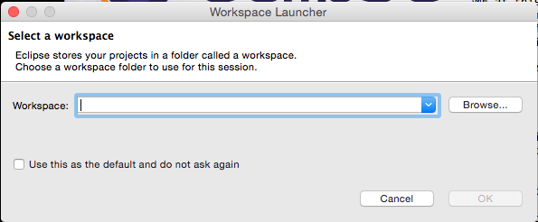
4. Click "Browse" and set your workspace to $LOCAL\_REPO/AnalysisEngine, where $LOCAL\_REPO is where this repo was cloned to.  Click "Open" and then "Okay"
5. You should see the following 
6. On the top menu bar, select "File" -> "Import"  This screenshot shows OSX, but the flow is the same for other OS's 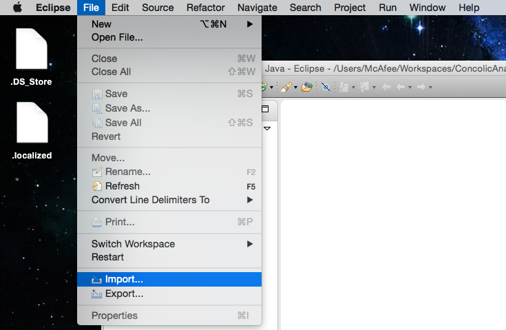
7. On the window that pops up, select "Maven" -> "Existing Maven Projects" 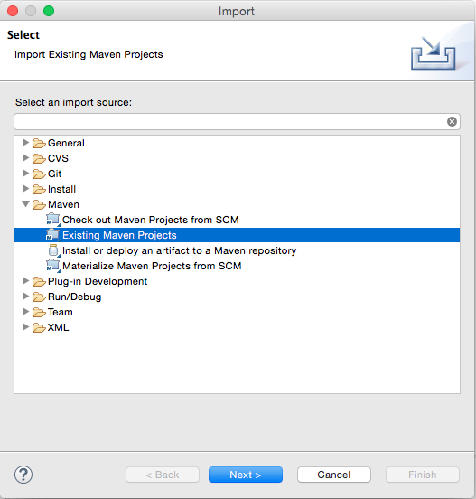
8. You should see the following 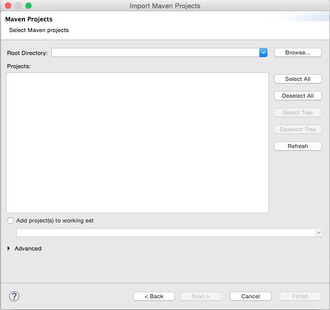
8. On the next window, select "Browse" in the top right, select the $LOCAL\_REPO/AnalysisEngine directory (should be the default) and click "Okay." After a scan, you should see something like the following 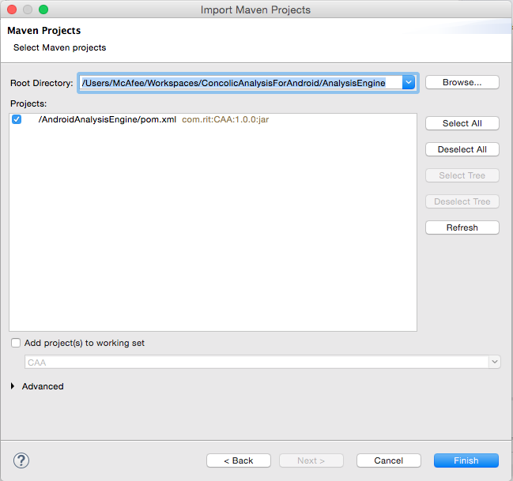
9. Eclipse should now have the project open, similar to this 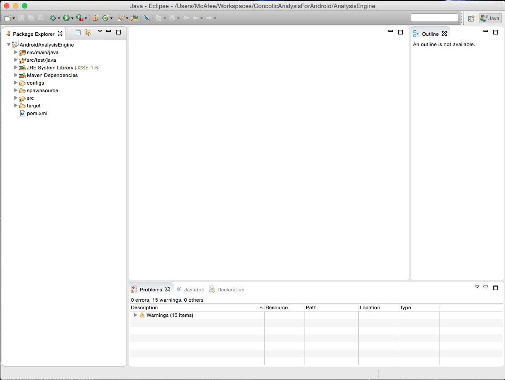

### Running the project inside Eclipse during development

1. Before going any further, make sure you have run through the _General Setup_ part of this guide.  The virtual machine does not need to stay running while developing, but several tools are downloaded during the initial setup
2. If you're running Eclipse inside the Vagrant VM, skip this step.  Otherwise, copy the file "site.properties" from "$LOCAL\_REPO/puppet/modules/java-pathfinder/sources" to "~/.jpf" as this is required for Java Pathfinder to run correctly.  Make sure to update the following in your copy
  1. jpf-core = $LOCAL\_REPO/AnalysisEngine/tools/jpf/jpf-core, where $LOCAL\_REPO is where you cloned the repository
  2. jpf-symbc = $LOCAL\_REPO/AnalysisEngine/tools/jpf/jpf-symbc, where $LOCAL\_REPO is where you cloned the repository
3. In Eclipse, go to the menu bar and select "Run" -> "Run Configurations" 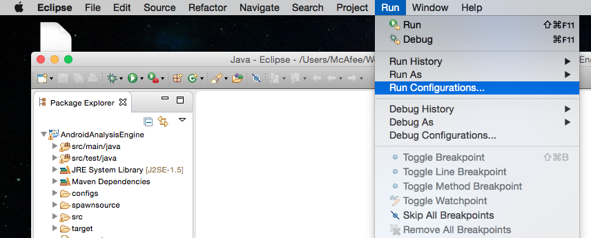
4. You should see the following 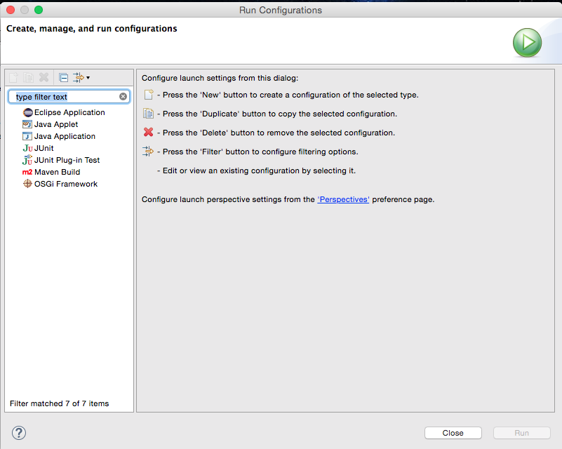
5. Double click "Java Application" and the following should appear 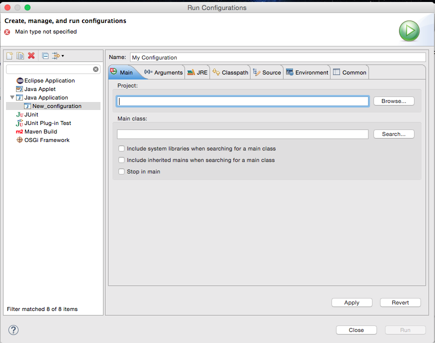
6. Give your run configuration a name.  The project should be "AndroidAnalysisEngine" and the main class should be "com.rit.AndroidAnalysisEngine.App" 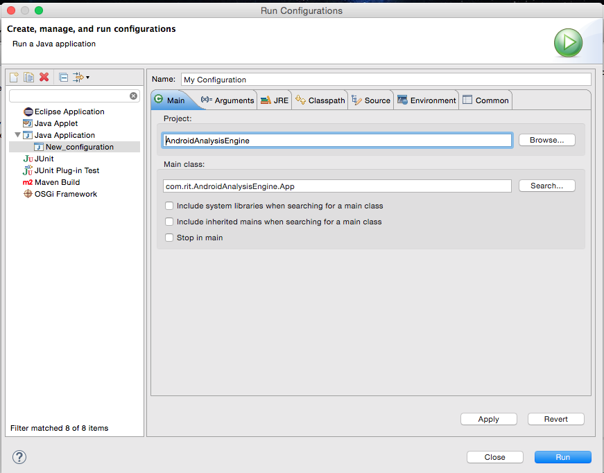
7. Click the Arguments tab just under the name field.  For program arguments, enter without quotes "-apk $AN\_APK\_FILE" *where $AN\_APK\_FILE is either an absolute path or a path relative to $LOCAL\_REPO/AnalysisEngine/AndroidAnalysisEngine* where there is an apk 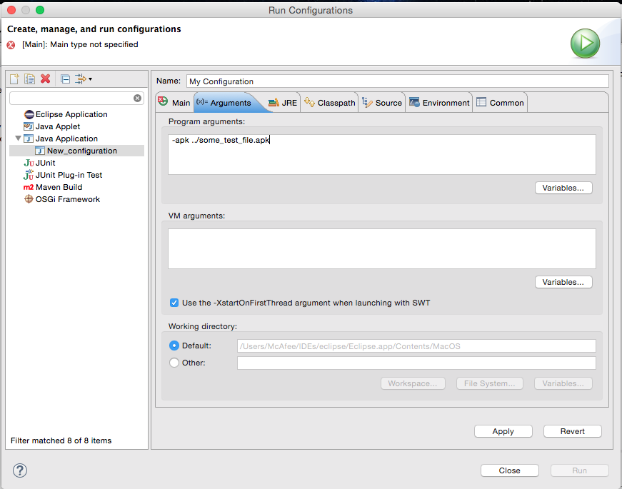
8. Click "Apply" and "Close." At this point, you should be able to use the Debug and Play buttons to start the app 
9. Once one of those button is clicked, you should see output in the Terminal window at the bottom, starting with "Firing up!" The output of this is shown below. 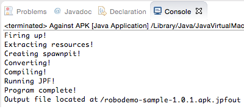

10. A sample of the final tool output is shown below:
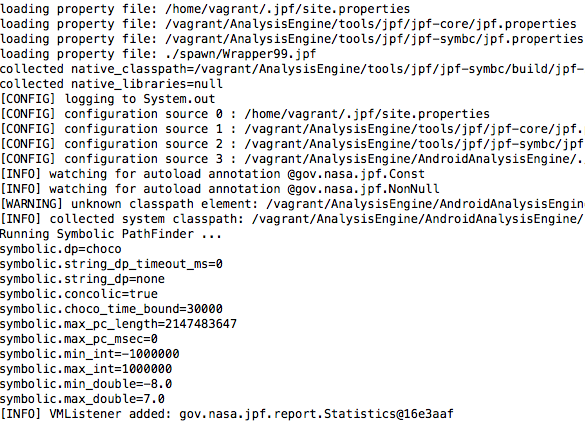

## Credits

Original idea from Daniel Krutz.  Based in part from research by Justin Peterson
